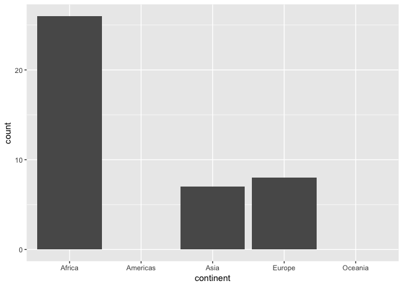

cm012 Exercises: Factors
================

`forcats` package comes loaded with `tiyverse`:

``` r
suppressPackageStartupMessages(library(tidyverse))
library(gapminder)
```

Factors
=======

Resources
---------

-   Exercises are based on <http://stat545.com/block029_factors.html> and <http://r4ds.had.co.nz/factors.html>. Some content was taken from the former.

Intro to Factors
----------------

What is a factor? A "truly categorical" variable. You can think of it as a vector that:

-   has character entries on the surface
-   are integers underneath
-   has **levels**

Examples of Base R's obsession with coercing to factors:

``` r
data.frame(x=c("A", "B")) %>% 
  str()
```

    ## 'data.frame':    2 obs. of  1 variable:
    ##  $ x: Factor w/ 2 levels "A","B": 1 2

``` r
lotr1 <- "https://raw.githubusercontent.com/jennybc/lotr-tidy/master/data/The_Fellowship_Of_The_Ring.csv" %>% 
  read.csv()
lotr2 <- "https://raw.githubusercontent.com/jennybc/lotr-tidy/master/data/The_Return_Of_The_King.csv" %>% 
  read.csv()
str(lotr1)
```

    ## 'data.frame':    3 obs. of  4 variables:
    ##  $ Film  : Factor w/ 1 level "The Fellowship Of The Ring": 1 1 1
    ##  $ Race  : Factor w/ 3 levels "Elf","Hobbit",..: 1 2 3
    ##  $ Female: int  1229 14 0
    ##  $ Male  : int  971 3644 1995

``` r
str(lotr2)
```

    ## 'data.frame':    3 obs. of  4 variables:
    ##  $ Film  : Factor w/ 1 level "The Return Of The King": 1 1 1
    ##  $ Race  : Factor w/ 3 levels "Elf","Hobbit",..: 1 2 3
    ##  $ Female: int  183 2 268
    ##  $ Male  : int  510 2673 2459

Examples of problems encountered with factors. (ideas came from [R Bloggers](https://www.r-bloggers.com/factors-are-not-first-class-citizens-in-r/))

``` r
#change the levels in species
iris %>% 
  mutate(Species = ifelse(Species == "versicolor", "vers", Species))%>%
  str()
```

    ## 'data.frame':    150 obs. of  5 variables:
    ##  $ Sepal.Length: num  5.1 4.9 4.7 4.6 5 5.4 4.6 5 4.4 4.9 ...
    ##  $ Sepal.Width : num  3.5 3 3.2 3.1 3.6 3.9 3.4 3.4 2.9 3.1 ...
    ##  $ Petal.Length: num  1.4 1.4 1.3 1.5 1.4 1.7 1.4 1.5 1.4 1.5 ...
    ##  $ Petal.Width : num  0.2 0.2 0.2 0.2 0.2 0.4 0.3 0.2 0.2 0.1 ...
    ##  $ Species     : chr  "1" "1" "1" "1" ...

``` r
c(iris$Species, "setosa")
```

    ##   [1] "1"      "1"      "1"      "1"      "1"      "1"      "1"     
    ##   [8] "1"      "1"      "1"      "1"      "1"      "1"      "1"     
    ##  [15] "1"      "1"      "1"      "1"      "1"      "1"      "1"     
    ##  [22] "1"      "1"      "1"      "1"      "1"      "1"      "1"     
    ##  [29] "1"      "1"      "1"      "1"      "1"      "1"      "1"     
    ##  [36] "1"      "1"      "1"      "1"      "1"      "1"      "1"     
    ##  [43] "1"      "1"      "1"      "1"      "1"      "1"      "1"     
    ##  [50] "1"      "2"      "2"      "2"      "2"      "2"      "2"     
    ##  [57] "2"      "2"      "2"      "2"      "2"      "2"      "2"     
    ##  [64] "2"      "2"      "2"      "2"      "2"      "2"      "2"     
    ##  [71] "2"      "2"      "2"      "2"      "2"      "2"      "2"     
    ##  [78] "2"      "2"      "2"      "2"      "2"      "2"      "2"     
    ##  [85] "2"      "2"      "2"      "2"      "2"      "2"      "2"     
    ##  [92] "2"      "2"      "2"      "2"      "2"      "2"      "2"     
    ##  [99] "2"      "2"      "3"      "3"      "3"      "3"      "3"     
    ## [106] "3"      "3"      "3"      "3"      "3"      "3"      "3"     
    ## [113] "3"      "3"      "3"      "3"      "3"      "3"      "3"     
    ## [120] "3"      "3"      "3"      "3"      "3"      "3"      "3"     
    ## [127] "3"      "3"      "3"      "3"      "3"      "3"      "3"     
    ## [134] "3"      "3"      "3"      "3"      "3"      "3"      "3"     
    ## [141] "3"      "3"      "3"      "3"      "3"      "3"      "3"     
    ## [148] "3"      "3"      "3"      "setosa"

``` r
as.factor(iris$Species)#can also use  as.character
```

    ##   [1] setosa     setosa     setosa     setosa     setosa     setosa    
    ##   [7] setosa     setosa     setosa     setosa     setosa     setosa    
    ##  [13] setosa     setosa     setosa     setosa     setosa     setosa    
    ##  [19] setosa     setosa     setosa     setosa     setosa     setosa    
    ##  [25] setosa     setosa     setosa     setosa     setosa     setosa    
    ##  [31] setosa     setosa     setosa     setosa     setosa     setosa    
    ##  [37] setosa     setosa     setosa     setosa     setosa     setosa    
    ##  [43] setosa     setosa     setosa     setosa     setosa     setosa    
    ##  [49] setosa     setosa     versicolor versicolor versicolor versicolor
    ##  [55] versicolor versicolor versicolor versicolor versicolor versicolor
    ##  [61] versicolor versicolor versicolor versicolor versicolor versicolor
    ##  [67] versicolor versicolor versicolor versicolor versicolor versicolor
    ##  [73] versicolor versicolor versicolor versicolor versicolor versicolor
    ##  [79] versicolor versicolor versicolor versicolor versicolor versicolor
    ##  [85] versicolor versicolor versicolor versicolor versicolor versicolor
    ##  [91] versicolor versicolor versicolor versicolor versicolor versicolor
    ##  [97] versicolor versicolor versicolor versicolor virginica  virginica 
    ## [103] virginica  virginica  virginica  virginica  virginica  virginica 
    ## [109] virginica  virginica  virginica  virginica  virginica  virginica 
    ## [115] virginica  virginica  virginica  virginica  virginica  virginica 
    ## [121] virginica  virginica  virginica  virginica  virginica  virginica 
    ## [127] virginica  virginica  virginica  virginica  virginica  virginica 
    ## [133] virginica  virginica  virginica  virginica  virginica  virginica 
    ## [139] virginica  virginica  virginica  virginica  virginica  virginica 
    ## [145] virginica  virginica  virginica  virginica  virginica  virginica 
    ## Levels: setosa versicolor virginica

``` r
attach(iris)
table(Species)
```

    ## Species
    ##     setosa versicolor  virginica 
    ##         50         50         50

-   Base R way of interacting with factors:
    -   `factor()`, or `forcats::parse_factor()`.
    -   `levels()`
    -   `nlevels()`
    -   `forcats::fct_count()`

Here is a sample of 10 letters drawn from the possibilities "a", "b", and "c":

``` r
set.seed(10)
(draw <- sample(letters[1:3], size = 10, replace = TRUE))
```

    ##  [1] "b" "a" "b" "c" "a" "a" "a" "a" "b" "b"

Convert `draw` to a factor. What are the levels? How many are there? How many of each category was drawn?

``` r
draw = factor(draw)

draw
```

    ##  [1] b a b c a a a a b b
    ## Levels: a b c

``` r
levels(draw)
```

    ## [1] "a" "b" "c"

``` r
nlevels(draw)
```

    ## [1] 3

``` r
fct_count(draw)
```

    ## # A tibble: 3 x 2
    ##   f         n
    ##   <fct> <int>
    ## 1 a         5
    ## 2 b         4
    ## 3 c         1

Concatenating Factors
---------------------

We saw that `c()` doesn't work for concatenating. Modify the following code to use `fct_c()` from the `forcats` package:

``` r
c(lotr1$Film, lotr2$Film)
```

    ## [1] 1 1 1 1 1 1

``` r
library(forcats)
fct_c(lotr1$Film, lotr2$Film)
```

    ## [1] The Fellowship Of The Ring The Fellowship Of The Ring
    ## [3] The Fellowship Of The Ring The Return Of The King    
    ## [5] The Return Of The King     The Return Of The King    
    ## Levels: The Fellowship Of The Ring The Return Of The King

Try binding by row `lotr1` and `lotr2`:

-   with `rbind()`
-   with `bind_rows()`

Which one is more lenient? Which would you prefer?

``` r
rbind(lotr1,lotr2) %>% str()
```

    ## 'data.frame':    6 obs. of  4 variables:
    ##  $ Film  : Factor w/ 2 levels "The Fellowship Of The Ring",..: 1 1 1 2 2 2
    ##  $ Race  : Factor w/ 3 levels "Elf","Hobbit",..: 1 2 3 1 2 3
    ##  $ Female: int  1229 14 0 183 2 268
    ##  $ Male  : int  971 3644 1995 510 2673 2459

``` r
#bind_rows will give us some warnings if we add different levels
bind_rows(lotr1,lotr2) %>% str() #notice that film now is a character
```

    ## Warning in bind_rows_(x, .id): Unequal factor levels: coercing to character

    ## Warning in bind_rows_(x, .id): binding character and factor vector,
    ## coercing into character vector

    ## Warning in bind_rows_(x, .id): binding character and factor vector,
    ## coercing into character vector

    ## 'data.frame':    6 obs. of  4 variables:
    ##  $ Film  : chr  "The Fellowship Of The Ring" "The Fellowship Of The Ring" "The Fellowship Of The Ring" "The Return Of The King" ...
    ##  $ Race  : Factor w/ 3 levels "Elf","Hobbit",..: 1 2 3 1 2 3
    ##  $ Female: int  1229 14 0 183 2 268
    ##  $ Male  : int  971 3644 1995 510 2673 2459

Unused Levels
-------------

Levels don't always have to be present ("observed") in the factor. Example of what this means:

``` r
gap_gs <- gapminder %>% 
  filter(country %in% c("Germany", "Sweden"))
nlevels(gap_gs$country)#all countries are still stored
```

    ## [1] 142

``` r
table(gap_gs$country )
```

    ## 
    ##              Afghanistan                  Albania                  Algeria 
    ##                        0                        0                        0 
    ##                   Angola                Argentina                Australia 
    ##                        0                        0                        0 
    ##                  Austria                  Bahrain               Bangladesh 
    ##                        0                        0                        0 
    ##                  Belgium                    Benin                  Bolivia 
    ##                        0                        0                        0 
    ##   Bosnia and Herzegovina                 Botswana                   Brazil 
    ##                        0                        0                        0 
    ##                 Bulgaria             Burkina Faso                  Burundi 
    ##                        0                        0                        0 
    ##                 Cambodia                 Cameroon                   Canada 
    ##                        0                        0                        0 
    ## Central African Republic                     Chad                    Chile 
    ##                        0                        0                        0 
    ##                    China                 Colombia                  Comoros 
    ##                        0                        0                        0 
    ##         Congo, Dem. Rep.              Congo, Rep.               Costa Rica 
    ##                        0                        0                        0 
    ##            Cote d'Ivoire                  Croatia                     Cuba 
    ##                        0                        0                        0 
    ##           Czech Republic                  Denmark                 Djibouti 
    ##                        0                        0                        0 
    ##       Dominican Republic                  Ecuador                    Egypt 
    ##                        0                        0                        0 
    ##              El Salvador        Equatorial Guinea                  Eritrea 
    ##                        0                        0                        0 
    ##                 Ethiopia                  Finland                   France 
    ##                        0                        0                        0 
    ##                    Gabon                   Gambia                  Germany 
    ##                        0                        0                       12 
    ##                    Ghana                   Greece                Guatemala 
    ##                        0                        0                        0 
    ##                   Guinea            Guinea-Bissau                    Haiti 
    ##                        0                        0                        0 
    ##                 Honduras         Hong Kong, China                  Hungary 
    ##                        0                        0                        0 
    ##                  Iceland                    India                Indonesia 
    ##                        0                        0                        0 
    ##                     Iran                     Iraq                  Ireland 
    ##                        0                        0                        0 
    ##                   Israel                    Italy                  Jamaica 
    ##                        0                        0                        0 
    ##                    Japan                   Jordan                    Kenya 
    ##                        0                        0                        0 
    ##         Korea, Dem. Rep.              Korea, Rep.                   Kuwait 
    ##                        0                        0                        0 
    ##                  Lebanon                  Lesotho                  Liberia 
    ##                        0                        0                        0 
    ##                    Libya               Madagascar                   Malawi 
    ##                        0                        0                        0 
    ##                 Malaysia                     Mali               Mauritania 
    ##                        0                        0                        0 
    ##                Mauritius                   Mexico                 Mongolia 
    ##                        0                        0                        0 
    ##               Montenegro                  Morocco               Mozambique 
    ##                        0                        0                        0 
    ##                  Myanmar                  Namibia                    Nepal 
    ##                        0                        0                        0 
    ##              Netherlands              New Zealand                Nicaragua 
    ##                        0                        0                        0 
    ##                    Niger                  Nigeria                   Norway 
    ##                        0                        0                        0 
    ##                     Oman                 Pakistan                   Panama 
    ##                        0                        0                        0 
    ##                 Paraguay                     Peru              Philippines 
    ##                        0                        0                        0 
    ##                   Poland                 Portugal              Puerto Rico 
    ##                        0                        0                        0 
    ##                  Reunion                  Romania                   Rwanda 
    ##                        0                        0                        0 
    ##    Sao Tome and Principe             Saudi Arabia                  Senegal 
    ##                        0                        0                        0 
    ##                   Serbia             Sierra Leone                Singapore 
    ##                        0                        0                        0 
    ##          Slovak Republic                 Slovenia                  Somalia 
    ##                        0                        0                        0 
    ##             South Africa                    Spain                Sri Lanka 
    ##                        0                        0                        0 
    ##                    Sudan                Swaziland                   Sweden 
    ##                        0                        0                       12 
    ##              Switzerland                    Syria                   Taiwan 
    ##                        0                        0                        0 
    ##                 Tanzania                 Thailand                     Togo 
    ##                        0                        0                        0 
    ##      Trinidad and Tobago                  Tunisia                   Turkey 
    ##                        0                        0                        0 
    ##                   Uganda           United Kingdom            United States 
    ##                        0                        0                        0 
    ##                  Uruguay                Venezuela                  Vietnam 
    ##                        0                        0                        0 
    ##       West Bank and Gaza              Yemen, Rep.                   Zambia 
    ##                        0                        0                        0 
    ##                 Zimbabwe 
    ##                        0

``` r
as.character(gap_gs$country)
```

    ##  [1] "Germany" "Germany" "Germany" "Germany" "Germany" "Germany" "Germany"
    ##  [8] "Germany" "Germany" "Germany" "Germany" "Germany" "Sweden"  "Sweden" 
    ## [15] "Sweden"  "Sweden"  "Sweden"  "Sweden"  "Sweden"  "Sweden"  "Sweden" 
    ## [22] "Sweden"  "Sweden"  "Sweden"

Sometimes keeping the levels is good. Other times, not.

**Example of when it's good**:

Here's the gapminder data down to rows where population is less than a quarter of a million, i.e. 250,000:

``` r
gap_small <- gapminder %>% 
  filter(pop < 250000)
```

Exercise: Make a bar chart of the number of times a continent has a country with population &lt; 250,000 in the `gapminder` data set. Try with and without `scale_x_discrete(drop=FALSE)`.

``` r
gap_small %>% 
  ggplot(aes(continent))+
  geom_bar()+
  scale_x_discrete(drop=F )# keep the levels
```



**Example of when it's bad**: If you ever use the `levels()` function.

How to fix by dropping levels:

-   Base R: `droplevels()` operates on either an entire data frame or a factor.
-   `forcats::fct_drop()` only operates on a factor.

Exercise: get rid of the unused factor levels for country and continent in different ways:

-   `droplevels()`
-   `fct_drop()` inside `mutate()`
-   Re-defining the variable as a factor

``` r
gap_small %>% droplevels() %>% str()
```

    ## Classes 'tbl_df', 'tbl' and 'data.frame':    41 obs. of  6 variables:
    ##  $ country  : Factor w/ 7 levels "Bahrain","Comoros",..: 1 1 1 1 1 2 2 2 2 3 ...
    ##  $ continent: Factor w/ 3 levels "Africa","Asia",..: 2 2 2 2 2 1 1 1 1 1 ...
    ##  $ year     : int  1952 1957 1962 1967 1972 1952 1957 1962 1967 1952 ...
    ##  $ lifeExp  : num  50.9 53.8 56.9 59.9 63.3 ...
    ##  $ pop      : int  120447 138655 171863 202182 230800 153936 170928 191689 217378 63149 ...
    ##  $ gdpPercap: num  9867 11636 12753 14805 18269 ...

``` r
gap_small %>% mutate(continent= fct_drop(continent)) %>% str()
```

    ## Classes 'tbl_df', 'tbl' and 'data.frame':    41 obs. of  6 variables:
    ##  $ country  : Factor w/ 142 levels "Afghanistan",..: 8 8 8 8 8 27 27 27 27 36 ...
    ##  $ continent: Factor w/ 3 levels "Africa","Asia",..: 2 2 2 2 2 1 1 1 1 1 ...
    ##  $ year     : int  1952 1957 1962 1967 1972 1952 1957 1962 1967 1952 ...
    ##  $ lifeExp  : num  50.9 53.8 56.9 59.9 63.3 ...
    ##  $ pop      : int  120447 138655 171863 202182 230800 153936 170928 191689 217378 63149 ...
    ##  $ gdpPercap: num  9867 11636 12753 14805 18269 ...

Ordering
--------

Ordering of levels is alphabetical, by default. Usually not useful!

``` r
cont <- gapminder$continent
levels(cont)
```

    ## [1] "Africa"   "Americas" "Asia"     "Europe"   "Oceania"

Plotting happens in the order of the factor levels:

``` r
qplot(cont)
```


Much more effective to always consider a meaningful order when plotting a categorical variable. We'll look at three ways to re-order a factor.

### Ordering with the factor itself

Reorder by frequency:

-   Rearrange by frequency: `fct_infreq()`.
-   Reverse: `fct_rev()`

``` r
cont %>% 
  fct_infreq() %>% 
  fct_rev() %>% 
  qplot()
```


Could also arrange by the order they appear in the factor with `fct_inorder()`.

``` r
draw %>% fct_inorder() %>% fct_count()
```

    ## # A tibble: 3 x 2
    ##   f         n
    ##   <fct> <int>
    ## 1 b         4
    ## 2 a         5
    ## 3 c         1

### Ordering by Another Variable

Here are the 2007 life expectancies of Asian countries:

``` r
gap_asia_2007 <- gapminder %>% 
  filter(year == 2007, continent == "Asia")
ggplot(gap_asia_2007, aes(lifeExp, country)) + geom_point()
```


Let's use `fct_reorder()` to reorder the countries of `gap_asia_2007` by life Expectancy, and produce the same plot:

``` r
gap_asia_2007 %>% 
  mutate(country=fct_reorder(country,lifeExp)) %>% 
  ggplot( aes(lifeExp, country)) + geom_point()
```


What about when life Expectancy is not unique? Example: life expectancy of each continent:

``` r
ggplot(gapminder, aes(continent, lifeExp)) +
  geom_violin()
```


``` r
ggplot(gapminder, aes(continent, lifeExp)) +
  geom_boxplot()
```


`fct_reorder(f, x)` still works, but does some internal wrangling: a summary statistic (default: median) is computed on `x` for each category in the factor `f`.

Exercise: Try making the above box plot and violin plots, ordered by median lifeExp. Try other functions to order by by modifying the `.fun` argument.

``` r
# order summary stats (default: median)/ we can change it with .fun
gapminder %>% 
  mutate(continent= fct_reorder(continent, lifeExp,.fun=sd)) %>% 
  ggplot(aes(continent, lifeExp))+
  geom_boxplot()
```


What if we have two variables plus a non-positional categorical variable? Example: Life expectancy for some select countries. Want legend "ordered by life expectancy" -- but what does that mean?

``` r
select_countries <- c("Sweden", "Denmark", "Norway", "Germany", "Austria")
gap_select <- gapminder %>% 
  filter(country %in% select_countries) %>% 
  droplevels()
ggplot(gap_select, aes(year, lifeExp)) +
  geom_line(aes(group=country, colour=country))
```


Use `fct_reorder2(f, x, y)` to reorder factor `f`:

-   `.fun` is a function of `x` and `y`. Should return a single value, and is applied to each category.
-   Default is `.fun = last2`, which looks at x-y plot for each category; uses the y-value furthest to the right.

Exercise: Reorder the above line graph so that the legend is in order of last life expectancy. Useful for black-and-white printing!

``` r
gap_select %>% mutate(country=fct_reorder2(country,year, lifeExp)) %>%
  ggplot(aes(year, lifeExp)) +
  geom_line(aes(group=country, colour=country))
```


### Ordering "because I said so"

Remember the plot of Asian life expectancies in 2007? What if you're preparing a report for the Syrian government? You'd want to put Syria first (for reasons external to the data).

Here's how to use `fct_relevel()` to do that. Exercise: modify the code so that:

-   in addition, Sweden goes second.
-   instead of first, Syria goes after the third level. Hint: use `after=`.

``` r
gap_asia_2007$country %>% 
  fct_relevel("Syria","Sweden", after=2) %>% #put syria at 3rd 
  table() %>% 
  head()
```

    ## .
    ## Afghanistan     Albania       Syria      Sweden     Algeria      Angola 
    ##           1           0           1           0           0           0

Re-coding a Factor
------------------

Want "United States" to read "USA" instead? Just use `fct_recode()`. (Sadly, no metaprogramming happens here).

Exercise: modify the following code to also change "Canada" to read "Can". Hint: use a comma.

``` r
gap_big_north <- gapminder %>% 
  filter(country %in% c("Canada", "United States", "Mexico")) %>% 
  droplevels() 

gap_big_north$country %>% 
  fct_recode("USA" = "United States") %>% 
  levels()
```

    ## [1] "Canada" "Mexico" "USA"

Condensing a Factor
-------------------

We can specify levels to combine. Let's look at the world in 2007:

``` r
gap_2007 <- gapminder %>% 
  filter(year == 2007)
```

We can arbitrarily combine levels using `fct_collapse()`. For example, combine Europe and Asia into one factor called "combo":

``` r
cont %>% 
  fct_collapse("combo" = c("Europe", "Asia")) %>% 
  qplot()
```


More practically, we can lump the least frequent levels together as "Other". Modify the above code to use `fct_lump()` instead of `fct_collapse()` so that:

-   The bar chart shows the two most frequently observed continents,
-   The bar chart shows the two least frequently observed continents (Hint: use negative `n`).
-   You let `fct_lump()` decide on the number of non-other continents. How is this chosen?
-   Note: you can manually specify non-other levels using `fct_other()`.

``` r
cont %>% fct_lump() %>% qplot()
```


``` r
cont %>% fct_lump(n=2) %>% qplot()
```


``` r
cont %>% fct_other(keep = "Africa") %>% qplot()
```


We can use the `w` argument to lump by another variable.

Exercise: Modify the following violin plot of life expectancies of African countries, so that:

1.  There are 4 "violins" corresponding to countries with the highest lifeExp.
2.  There are 4 "violins" corresponding to countries with the highest gdpPercap

``` r
gap_africa <- gapminder %>% 
    filter(continent == "Africa")
gap_africa %>% 
    mutate(country = fct_lump(country)) %>% 
    ggplot(aes(country, lifeExp)) +
    geom_violin()
```


Exercises
---------

Use the `gss_cat` data to answer the following questions (from <http://r4ds.had.co.nz/factors.html>).

1.  (15.3.1 Ex. 1) Explore the distribution of rincome (reported income). What makes the default bar chart hard to understand? How could you improve the plot?

2.  (15.3.2 Ex. 2) What is the most common relig in this survey? What’s the most common partyid?

3.  (15.5.1 Ex. 1) How have the proportions of people identifying as Democrat, Republican, and Independent changed over time? Modify the following plot to a friendlier legend order.

``` r
gss_cat %>%
  mutate(partyid = fct_collapse(partyid,
    other = c("No answer", "Don't know", "Other party"),
    rep = c("Strong republican", "Not str republican"),
    ind = c("Ind,near rep", "Independent", "Ind,near dem"),
    dem = c("Not str democrat", "Strong democrat")
  )) %>% 
  count(year, partyid) %>% 
  ggplot(aes(year, n)) +
  geom_line(aes(group=partyid, colour=partyid))
```


Dates and Times with Lubridate
==============================

Goal here: some exposure to `lubridate`; know it exists.

1.  Use different combinations of y, m, d to make a date time object.

``` r
lubridate::ymd(170511)
```

    ## [1] "2017-05-11"

``` r
lubridate::ymd("2017-May-11")
```

    ## [1] "2017-05-11"

1.  Get `year`, `month`, `yday`, `wday`, `day`.

2.  Add durations (exact time spans) with `ddays`, `dweeks`, ... and periods (human-interpretable time spans) with `days`, `weeks`, and especially `months`.
